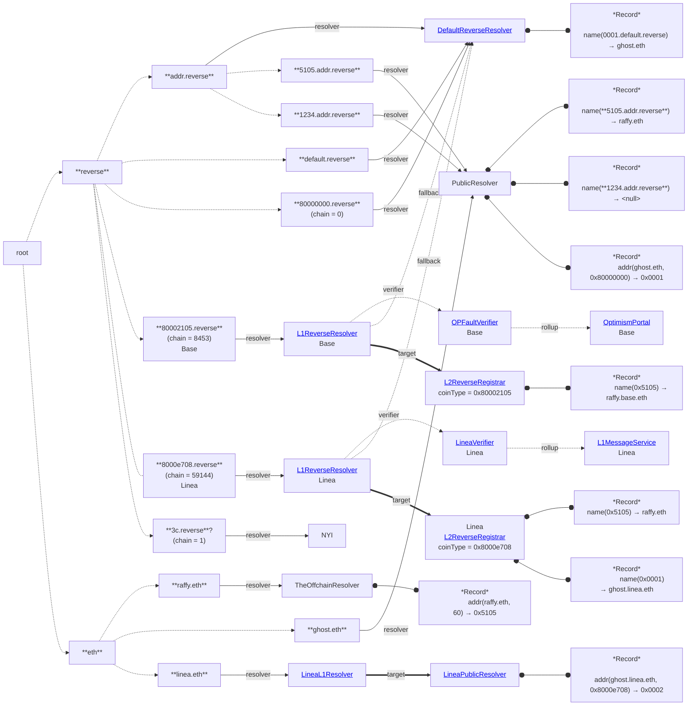

# L2 Primary Name Deployment

## Resolution Examples

1. `resolve("5105.addr.reverse", name())`
	* `resolver("5105.addr.reverse") = PublicResolver`
		* `name() = "raffy.eth"`
		* `resolve("raffy.eth", multicall(addr(), addr(0x80000000)))`
			* `resolver("raffy.eth") = TheOffchainResolver`
				* `resolve() = [0x5105, 0x]`
				* `checkedAddress = 0x5105`
	* ✅️ `0x5105 == 0x5105`
1. `resolve("1234.addr.reverse", name())`
	* `resolver("1234.addr.reverse") = PublicResolver`
		* `resolve(name()) = ""`
		* 🛑️
1. `resolve("0001.addr.reverse", name()`
	* `resolver("0001.addr.reverse") = null`
	* `resolver("addr.reverse") = DefaultReverseResolver`
		* `resolve(name()) = "ghost.eth"`
		* `resolve("ghost.eth", multicall(addr(), addr(0x80000000)))`
			* `resolver("ghost.eth") = PublicResolver`
				* `resolve() = [0x, 0x0001]`
				`checkedAddress = 0x0001`
	* ✅️ `0x0001 == 0x0001`
1. `resolve("5105.default.reverse", name())`
	* `resolver("5105.default.reverse") = null`
	* `resolver("default.reverse") = DefaultReverseResolver`
		* `resolve(name()) = ""`
		* 🛑️
1. `resolve("5105.80000000.reverse", name())`
	* *same as above*
1. `resolve("5105.8000e708.reverse", name())`
	* `resolver("5105.8000e708.reverse) = null`
	* `resolver("8000e708.reverse") = L1ReverseResolver`
		* `resolve(name()) = "raffy.eth"` (L1 &rarr; L2)
		* `resolve("raffy.eth", multicall(addr(0x8000e708), addr(0x80000000)))`
			* `resolver("raffy.eth") = TheOffchainResolver`
				* `resolve() = [0x, 0x]`
				* 🛑️
1. `resolve("0001.8000e708.reverse", name())`
	* `resolver("0001.8000e708.reverse) = null`
	* `resolver("8000e708.reverse") = L1ReverseResolver`
		* `resolve(name()) = "ghost.linea.eth"` (L1 &rarr; L2)
		* `resolve("ghost.linea.eth", multicall(addr(0x8000e708), addr(0x80000000)))`
			* `resolver("ghost.linea.eth") = null`
			* `resolver("linea.eth") = LineaL1Resolver`
				* `resolve() = [0x0002, 0x]`
				* `checkedAddress = 0x0002`
	* 🛑️ `0x0001 != 0x0002`