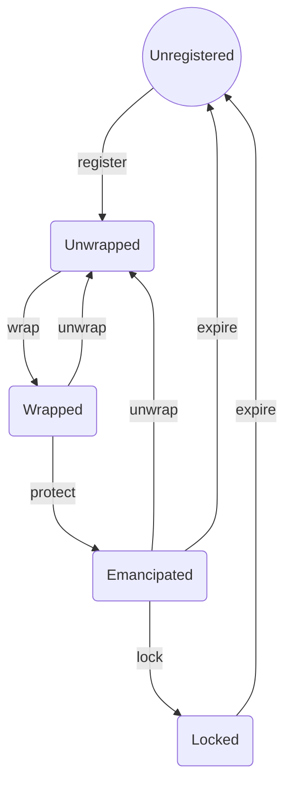

# NameWrapper docs

The NameWrapper wraps ENS names, adding new functionality to them:

- Makes all ENS names at any level into ERC1155 tokens.
- Supports 'emancipating' names by allowing the owner of a parent name to revoke control over subdomains.
- Supports 'locking' names by allowing the owner of a name to revoke control over changes in resolver, creation of subdomains, and other parameters.
- Wrapped names can expire; a name that is emancipated or locked has a built in expiration at which the name (and that status) expires.
- UIs and Smart Contracts can check the status of a name with a single function call, allowing them to ensure security guarantees are upheld.
- .eth names can be registered and renewed via the wrapper, removing any need to wrap names separately after registration.
- Owners of names can create wrapped subdomains directly, without having to register-then-wrap.

## Glossary of terms

- Wrap - Transfers ownership of the ENS name to the Name Wrapper. The wrapper then issues an ERC1155 token for the name.
- Unwrap - Reverses the wrap process and transfers the name to an address of the token owner's choice.
- Fuse - The term for a flag that can be set irreversibly until expiry. Fuses can do many things, including controlling permissions for the name itself.
- Emancipation - The process of the owner of a parent name revoking its control over a subname.
- Locking - The process of the owner of a name revoking some level of control over its own name.
- Owner-controlled fuses - Fuses that can be burned by the owner of a name or the owner of the parent name if the name is not emancipated.
- Parent-controlled fuses - Fuses that can be burned by the owner of the parent name.
- Expiry - Expiry is the date when the name expires and is no longer able to be owned. Expiry only comes into effect when a name is emancipated or locked. Expiry can be extended by parent or approved addresses, and if the parent burnt the parent controlled fuses(PCF), then the subnames can extend their expiry by themselves. However, the PCF can be unburnt later if the parent name expires. For the latest update, refer to: https://discuss.ens.domains/t/namewrapper-updates-including-testnet-deployment-addresses/14505/48

## Lifecycle of a name

The behaviour of names and the name wrapper is best thought of in terms of a state machine, whose states names proceed through over their lifecycles:



State transitions are facilitated by functions on the name wrapper and registrar controller contracts. One function can potentially move a name through multiple states - for example, calling `registerAndWrapETH2LD()` will register a .eth second-level name, wrap it, and emancipate it, moving it from `[Unregistered]` to `Emancipated` state in a single call.

Some state transitions are irrevocable; once a name is Emancipated or Locked, it can only return to being Wrapped or Unwrapped after it expires.

### Name States

#### Unregistered

Names start out in the unregistered state before they are registered, and return to it after they expire.

To check if a name is Unregistered, verify that `NameWrapper.ownerOf` returns `address(0)` and `Registry.owner` returns either `address(0)` or the address of the NameWrapper contract.

#### Unwrapped

A name that is registered but not managed by the name wrapper is Unwrapped.

Unwrapped names do not expire, with the exception of .eth second-level names, which have behaviour enforced by the .eth registrar.

To check if a name is Unwrapped, verify that `NameWrapper.ownerOf` returns `address(0)` and `Registry.owner` returns any address except for `address(0)` or the address of the NameWrapper contract.

#### Wrapped

Wrapping an Unwrapped name makes it Wrapped. Wrapped names are managed by the name wrapper, and have ERC1155 tokens, but can be unwrapped at any time, and have no special protections over and above an unwrapped name - for example, the owner of the parent name can still make changes to the name or take back ownership.

Wrapped names do not expire, with the exception of .eth second-level names, which have behaviour enforced by the .eth registrar, and have a wrapper expiry equal to the end of the name's grace period.

To check if a name is Wrapped, verify that `NameWrapper.ownerOf(node)` does not return `address(0)`, `Registry.owner` is the NameWrapper contract and if it's a .eth name `registrar.ownerOf(labelhash)` must be the NameWrapper contract. If any of these are false, the name should be consider unwrapped.

#### Emancipated

An Emancipated name provides the assurance that the owner of the parent name cannot affect it in any way until it expires.

A name is Emancipated when the owner of the parent domain gives up control over it. They do this by setting an expiration date - which can be extended at any time - and burning the `PARENT_CANNOT_CONTROL` fuse over the name. To do this, the parent name must already be in the `Locked` state.

.eth second-level names are automatically Emancipated when wrapped, and their expiry is fixed at the end of the grace period in the .eth registrar.

An Emancipated name can be unwrapped - but when it is wrapped again it will automatically return to the `Emancipated` state.

When the expiration set by the owner of the parent domain is reached, the name expires and moves to the `Unregistered` state.

To check if a name is Emancipated, verify that the `PARENT_CANNOT_CONTROL` fuse is burned, and the `CANNOT_UNWRAP` fuse is not.

#### Locked

A Locked name provides the assurance that neither the owner of the name nor the owner of any parent name can affect it until it expires.

A name is Locked when the owner of the name revokes their ability to unwrap the name. Only Emancipated names can be Locked, and Locking is a prerequisite for Emancipating subnames. A name can also be optionally locked when a parent emancipates a name, by burning both `PARENT_CANNOT_CONTROL` and `CANNOT_UNWRAP`

Additional permissions over a name can be revoked, such as the ability to create subdomains or set the resolver, and Locking is a prerequisite for revoking these permissions as well.

To check if a name is Locked, verify that the `CANNOT_UNWRAP` fuse is burned.

## Expiry

The NameWrapper tracks an expiration time for each name. Expiry of names is not enabled by default. This means you can leave expiry at 0 or a number less than `block.timestamp` and the name will have an owner and be able to set records. Expiry causes fuses to reset for any wrapped name. However the name itself will only expire if it is in the Emancipated or Locked state.

For all wrapped names, the following change happens when the expiry has been reached:

- The NameWrapper treats all fuses as unset and returns uint32(0) from `getData()` for fuses.

In addition, if the name is Emancipated or Locked, the following change happens when the expiry has been reached:

- The NameWrapper returns `address(0)` as the name owner from `ownerOf()` or `getData()`.

If a name is Wrapped (but not Emancipated or Locked), then the expiry will only cause parent-controlled fuses to reset, and otherwise has no practical effect on the name.

.eth names derive their expiry from the .eth registrar; the wrapper's expiry is set to the end of the name's grace period. A name that is extended using the Name Wrapper aware .eth registrar controller calling `renew()` or wrapped using `wrapETH2LD()`, the name's expiry will **sync** the wrapper expiry to the .eth registrar expiry. At the expiry date, the .eth name will be frozen for the entirety of the grace period. This includes all functionality that checks the owner, but does not affect its subdomains. If the name is renewed by a wrapper unaware .eth registrar controller, the wrapper expiry of the name will remain in the same expired state and will not sync.

Expiry can be extended using the following functions:

- `setChildFuses()`
- `setSubnodeOwner()`
- `setSubnodeRecord()`
- `renew()`
- `extendExpiry()`

`setChildFuses()` and `renew()` do not have any direct restrictions around when they can be called to extend expiry. `renew()` cannot be called on a name that has expired (past grace period) on the .eth registrar and must be re-registered instead.

`setSubnodeOwner()` and `setSubnodeRecord()` both revert when the subdomain is Emancipated or Locked.

`renew()` indirectly extends the expiry of a .eth name by renewing the name inside the .eth registrar.

`extendExpiry()` extends the expiry of any name. It can only be called by the owner of the name, an approved address or the owner of the parent name. When called by the owner of the name, the `CAN_EXTEND_EXPIRY` fuse must have already been burned by the parent. An approved address can be set by calling `approve()`.

## Fuses

Restrictions on names are handled by fuses. Fuses are labels that can be irreversibly added to a name until that name expires.

Fuses are split into two categories, owner-controlled fuses and parent-controlled fuses. Owner-controlled fuses can be set by either the owner of the name or the owner of the parent name, but parent-controlled fuses can only be set by the owner of the parent name.

When a fuse is set, we say it is "burned", to illustrate the one-way nature of fuses. Fuses cannot be unset, and will only reset if the name's expiry is less than the current `block.timestamp`.

There are three fuses that have special control over the burning mechanism: `PARENT_CANNOT_CONTROL`, `CANNOT_UNWRAP`, and `CANNOT_BURN_FUSES`.

- `PARENT_CANNOT_CONTROL` cannot be burned unless `CANNOT_UNWRAP` is burned on the parent name. Burning `PARENT_CANNOT_CONTROL` moves the name to the Emancipated state.
- `CANNOT_UNWRAP` cannot be burned unless `PARENT_CANNOT_CONTROL` is also burned. Burning `CANNOT_UNWRAP` moves the name to the Locked state.
- Other user-controlled fuses cannot be burned unless `CANNOT_UNWRAP` is burned.
- A parent name's owner can still extend the expiry of a name with `PARENT_CANNOT_CONTROL` burned.
- Burning `PARENT_CANNOT_CONTROL` prevents the owner of the parent name from burning any further fuses on the name.
- Burning `PARENT_CANNOT_CONTROL` ensures the parent cannot call `setSubnodeOwner()` or `setSubnodeRecord()` on that specific subdomain. This means that a parent cannot change the owner or records of a subdomain using `setSubnode*()` and additionally a parent cannot burn fuses or extend with `setSubnode*()` and `setChildFuses()`, since the functions are now restricted.
- Burning `PARENT_CANNOT_CONTROL` allows the parent or name owner to burn owner-controlled fuses. Until `PARENT_CANNOT_CONTROL` is burnt, no owner-controlled fuses can be set. This does not affect parent-controlled fuses.
- Important note for developers: To ensure `PARENT_CANNOT_CONTROL` is actually set and not automatically reset to 0, the expiry MUST be extended at the same time to be greater than the current block's timestamp.
- Burning `CANNOT_UNWRAP` ensures the name cannot be unwrapped.
- Other user-controlled fuses can only be burned if `CANNOT_UNWRAP` is also burned. This also allows the owner of the name to burn `PARENT_CANNOT_CONTROL` and all parent-controlled fuses on subdomains.
- `CANNOT_BURN_FUSES` can be burned to prevent any further changes to fuses. As with all user-controlled fuses, this cannot be burned unless `PARENT_CANNOT_CONTROL` and `CANNOT_UNWRAP` are both burned.

### List of pre-defined fuses

These fuses are used within the NameWrapper and are not available for custom use.

Anything that is not predefined here as a fuse can be also burnt as a custom fuse. Fuse bits 1-16 (the first uint16 of the uint32) can be burnt by the owner of the name, or by the owner of the parent name at the same time as burning `PARENT_CANNOT_CONTROL`. Fuse bits 17-32 (the second half of the uint32) can only be burnt by the owner of the parent name.

#### CANNOT_UNWRAP = 1

If this fuse is burned, the name cannot be unwrapped, and calls to unwrap and unwrapETH2LD, as well as other effects that would unwrap a name such as `setSubnodeOwner` will fail.

#### CANNOT_BURN_FUSES = 2

If this fuse is burned, no further fuses can be burned. This has the effect of 'locking open' some set of permissions on the name. Calls to setFuses, and other methods that modify the set of fuses, will fail. Other methods can still be called successfully so long as they do not specify new fuses to burn.

#### CANNOT_TRANSFER = 4

If this fuse is burned, the name cannot be transferred. Calls to safeTransferFrom and safeBatchTransferFrom will fail.

#### CANNOT_SET_RESOLVER = 8

If this fuse is burned, the resolver cannot be changed. Calls to setResolver, setRecord and setSubnodeRecord will fail.

#### CANNOT_SET_TTL = 16

If this fuse is burned, the TTL cannot be changed. Calls to setTTL, setRecord, and setSubnodeRecord will fail.

#### CANNOT_CREATE_SUBDOMAIN = 32

If this fuse is burned, new subdomains cannot be created. Calls to setSubnodeOwner and setSubnodeRecord will fail if they reference a name that does not already exist.

#### CANNOT_APPROVE = 64

If this fuse is burned, `approve()` cannot be called on this name anymore and so the current approved address cannot be changed until expiry.

#### PARENT_CANNOT_CONTROL = 65536

If this fuse is burned, existing subdomains cannot be replaced by the parent name and the parent can no longer burn other fuses on this child. Calls to setSubnodeOwner and setSubnodeRecord will fail if they reference a name that already exists. Attempting to burn fuses in setChildFuses will also fail. This fuse can only be burnt by the parent of a node.

#### IS_DOT_ETH = 131072

If this fuse is burned, it means that the name is a .eth name. This fuse cannot be burned manually and is burned when wrapETH2LD() or onERC721Received() is called.

#### CAN_EXTEND_EXPIRY = 262144

If this fuse is burned, a name will be able to extend its own expiry in the NameWrapper. Does not apply to .eth 2LDs, as the expiry will inherit from the registrar in that case, and this fuse will not be burned when wrapping/registering .eth 2LDs.

### Checking Fuses using `allFusesBurned(node, fuseMask)`

To check whether or not a fuse is burnt you can use this function that takes a fuse mask of all fuses you want to check.

```js
const areBurned = await allFusesBurned(
  namehash('vitalik.eth'),
  CANNOT_TRANSFER | CANNOT_SET_RESOLVER,
)
// if CANNOT_UNWRAP AND CANNOT_SET_RESOLVER are *both* burned this will return true
```

### Get current owner, fuses and expiry using `getData(node)`

getData gets the owner, fuses and also the expiry of the name. The fuses it returns will be a `uint32` and you will have to decode this yourself. If you just need to check a fuse has been burned, you can call `allFusesBurned` as it will use less gas.

## Function Reference

### `wrapETH2LD()`

**Start State**: Unwrapped
**End State**: Emancipated | Locked

Wraps a .eth second-level name. The wrapped name's expiration will always be equal to the name's expiration in the .eth registrar plus the grace period (90 days).

If fuses are provided, they will be burned at the same time as wrapping, moving the name directly to Locked status.

### `wrap()`

**Start State**: Unwrapped
**End State**: Wrapped | Emancipated

Wraps any name other than a .eth second-level name.

Parent-controlled fuses are retained on unwrap, so if the name was previously Emancipated and has not since expired, it will return directly to the Emancipated state.

### `onERC721Received()`

**Start State**: Unwrapped
**End State**: Emancipated | Locked

Wraps a .eth second-level name by sending the ERC721 NFT to the wrapper contract. Transfers must contain additional data encoding information about the wrapped name such as fuses and expiration, or they will be rejected.

Otherwise behaves identically to `wrapETH2LD`.

### `registerAndWrapETH2LD()`

**Start State**: Unregistered
**End State**: Emancipated | Locked

Allows a registrar controller to register and wrap a name in a single operation. After registering the name, behaves identically to `wrapETH2LD`.

### `renew()`

**Start State**: Emancipated | Locked
**End State**: Emancipated | Locked

Allows a registrar controller to renew a .eth second-level name.

### `setSubnodeOwner()`

**Start State**: Unregistered | Unwrapped | Wrapped
**End State**: Unregistered | Wrapped | Emancipated | Locked

Creates, replaces, or deletes a subname.

When called with a subname that does not yet exist, creates the name and wraps it.

When called with a subname that already exists, transfers the name to a new owner, wrapping it if necessary, provided the name is not Emancipated or Locked.

When called with a subname that exists and a new owner value of `address(0)`, unwraps and deletes the name.

If an expiration is provided, the subname's expiration will be set to the greater of the provided expiration and the one already on the subname.

If fuses are provided, they will be burned on the subname.

### `setSubnodeRecord()`

**Start State**: Unregistered | Unwrapped | Wrapped
**End State**: Wrapped | Emancipated | Locked

Creates or replaces a subname while updating resolver and TTL records.

Behaves identically to `setSubnodeOwner()`, additionally setting the resolver and TTL for the subname. If the new owner is `address(0)`, resolver and TTL are ignored.

### `unwrapETH2LD()`

**Start State**: Emancipated
**End State**: Unwrapped

Unwraps a .eth second-level name, provided that the name is not Locked.

### `unwrap()`

**Start State**: Wrapped | Emancipated
**End State**: Unwrapped

Unwraps any name other than a .eth second-level name, provided that the name is not Locked.

Parent-controlled fuses are retained on unwrap, so if the name was previously Emancipated and has not since expired, it will return directly to the Emancipated state if `wrap()` is called on it.

### `setRecord()`

**Start State**: Wrapped | Emancipated | Locked
**End State**: Unregistered | Wrapped | Emancipated | Locked

Mirrors the existing registry functionality, allowing you to set owner, resolver and ttl at the same time.

When called with an owner of `address(0)`, unwraps the name provided it is not Locked and not a .eth second-level name.

### `setFuses()`

**Start State**: Emancipated | Locked
**End State**: Locked

`setFuses()` can only be called by the owner of a name, and can burn any user-controlled fuses. It cannot burn parent-controlled fuses.

In order to burn any other fuse, `CANNOT_UNWRAP` must be burned as well, moving the name to the Locked state.

Cannot be called if `CANNOT_BURN_FUSES` has been burned.

### `extendExpiry()`

**Start State**: Wrapped | Emancipated | Locked
**End State**: Wrapped | Emancipated | Locked

`extendExpiry()` can only be called by the owner of a name, the owner of the parent name or an approved address (known as a renewal manager). When called by the owner of the name, the `CAN_EXTEND_EXPIRY` fuse must have already been burned by the parent. The approved address can be set by calling `approve

The expiry can only be extended, not reduced. And the max expiry is automatically set to the expiry of the parent node.

### `setChildFuses()`

**Start State**: Wrapped
**End State**: Emancipated | Locked

`setChildFuses()` can only be called the parent owner of a name. It can burn both user-controlled and parent-controlled fuses.

If the name is Emancipated or Locked, this function may be called to extend the expiry, but cannot burn any further fuses.

### Setting Records

The NameWrapper mirrors most of the functionality from the original ENS registry in its own API.

- `setResolver()`
- `setTTL()`
- `setRecord()`

`setResolver()` and `setTTL()` call the corresponding registry functions after checking that the caller is authorised.

`setRecord()` acts differently depending if the name is .eth or not. If you set the owner to `address(0)`, it will automatically unwrap the name and set the registry owner to 0, deleting the subdomain. If you set the owner to `address(0)`, but the name is a .eth 2LD, the function will revert as the ERC721 token cannot be set to the zero address. If the owner is not 0, it will simply transfer the ERC1155 to the specified owner within NameWrapper and set the resolver and ttl on the registry.

### Getting Data

The NameWrapper has 2 functions for getting data from the contract.

- `getData`
- `ownerOf`

`getData` gets the data that is stored for a name. This is a tuple of `owner`,`fuses` and `expiry`.

`ownerOf` will return the owner of a name. It adheres to the rules applied by emancipating a name. If the name is emancipated, expired names will return `address(0)` when calling `ownerOf`

### Subdomain management

Managing subdomains can be done with the same functions as in the registry:

- `setSubnodeOwner()`
- `setSubnodeRecord()`

These functions manage both creating and deleting subdomains, as well as changing their owner. They also have the ability to change the ttl and resolver, just like in the registry. The operation of these functions changes depending on whether or not the name is already wrapped and exists within the NameWrapper.

If a name does not exist within the NameWrapper, both functions will both create the name in the registry AND automatically wrap the name in the NameWrapper. This will emit a `NameWrapped` event and a `Transfer` event.

If a name does exist within the NameWrapper and the owner is set to a non-zero address, both functions will transfer the name to the new owner and emit a `Transfer` event.

If a name does exist within the NameWrapper and the owner is to set to the zero address, both functions will unwrap the name and set the owner in the registry to `address(0)`. This will also emit a `NameUnwrapped` event.

## Checking if a name is wrapped

To check if a name has been wrapped, call `isWrapped()`. This checks that the owner in the NameWrapper is non-zero

## Wrapping Names

If you transfer your subdomain to the NameWrapper using `registry.setSubnodeOwner()`, `registry.setSubnodeRecord` or `registry.setOwner()`, the NameWrapper will NOT recognise this as a wrap. There will be no `NameWrapped` event emitted, and there won't be an ERC1155 minted for that specific name. For this reason, if you want to check whether or not a name has been wrapped, you must check if the owner in the registry is the NameWrapper AND the owner in the NameWrapper is non-zero.

Since the NameWrapper does have `onERC721Received` support, the NameWrapper WILL recognise a transfer of the .eth registrar ERC721 token to the NameWrapper as a wrap.

## Register wrapped names

Names can be registered as normal using the current .eth registrar controller. However, the new .eth registrar controller will be a controller on the NameWrapper, and have NameWrapper will be a controller on the .eth base registrar. The NameWrapper exposes a `registerAndWrapETH2LD()` function that can be called by the new .eth registrar to directly register wrapped names. This new function removes the need to first transfer the owner to the contract itself before transferring it to the final owner, which saves gas.

Both .eth registrar controllers will be active during a deprecation period, giving time for front-end clients to switch their code to point at the new and improved .eth registrar controller.

## Ownership of the NameWrapper

The NameWrapper is an `Ownable()` contract and this owner has a few limited admin functions. Most of the functionality of the NameWrapper is trustless and names cannot be interfered with in any way even by the owner of the contract. The contract owner can do the following things:

- Change the metadata service URL.
- Add and remove controllers to the NameWrapper.
- Specify an upgrade target for a new name wrapper instance.

Controllers can call the following functions

- `registerAndWrapETH2LD()`
- `renew()`
- `setUpgradeContract()`

## Installation and setup

```bash
npm install
```

## Testing

```bash
npm run test
```

Any contract with `2` at the end, is referring to the contract being called by `account2`, rather than `account1`. This is for tests that require authorising another user.

## Deploying test contracts into Rinkeby

### Create .env

```
cp .env.org .env
```

### Set credentials

```
PRIVATE_KEY=
ETHERSCAN_API_KEY=
INFURA_API_KEY=
```

Please leave the following fields as blank

```
SEED_NAME=
METADATA_ADDRESS=
WRAPPER_ADDRESS=
RESOLVER_ADDRESS=
```

### Run deploy script

`bun run deploy:rinkeby` will deploy to rinkeby and verify its source code

NOTE: If you want to override the default metadata url, set `METADATA_HOST=` to `.env`

```
$ bun run deploy:rinkeby
$ npx hardhat run --network rinkeby scripts/deploy.js
Deploying contracts to rinkeby with the account:0x97bA55F61345665cF08c4233b9D6E61051A43B18
Account balance: 1934772596667918724 true
{
  registryAddress: '0x00000000000C2E074eC69A0dFb2997BA6C7d2e1e',
  registrarAddress: '0x57f1887a8BF19b14fC0dF6Fd9B2acc9Af147eA85'
}
Setting metadata service to https://ens-metadata-service.appspot.com/name/0x{id}
Metadata address: 0x08f2D8D8240fC70FD777358b0c63e539714DD473
Wrapper address: 0x88ce50eFeA21996B20838d5E71994191562758f9
Resolver address: 0x784b7B9BA0Fc04b90187c06C0C7efC51AeA06aFB
wait for 5 sec until bytecodes are uploaded into etherscan
verify  0x08f2D8D8240fC70FD777358b0c63e539714DD473 with arguments https://ens-metadata-service.appspot.com/name/0x{id}
verify  0x88ce50eFeA21996B20838d5E71994191562758f9 with arguments 0x00000000000C2E074eC69A0dFb2997BA6C7d2e1e,0x57f1887a8BF19b14fC0dF6Fd9B2acc9Af147eA85,0x08f2D8D8240fC70FD777358b0c63e539714DD473
verify  0x784b7B9BA0Fc04b90187c06C0C7efC51AeA06aFB with arguments 0x00000000000C2E074eC69A0dFb2997BA6C7d2e1e,0x88ce50eFeA21996B20838d5E71994191562758f9
```

After running the script it sets addresses to `.env`. If you want to redeploy some of contracts, remove the contract address from `.env` and runs the script again.

## Seeding test data into Rinkeby

1. Register a name using the account you used to deploy the contract
2. Set the label (`matoken` for `matoken.eth`) to `SEED_NAME=` on `.env`
3. Run `bun run seed:rinkeby`

```
~/.../ens/name-wrapper (seed)$ bun run seed:rinkeby
$ npx hardhat run --network rinkeby scripts/seed.js
Account balance: 1925134991223891632
{
  registryAddress: '0x00000000000C2E074eC69A0dFb2997BA6C7d2e1e',
  registrarAddress: '0x57f1887a8BF19b14fC0dF6Fd9B2acc9Af147eA85',
  wrapperAddress: '0x88ce50eFeA21996B20838d5E71994191562758f9',
  resolverAddress: '0x784b7B9BA0Fc04b90187c06C0C7efC51AeA06aFB',
  firstAddress: '0x97bA55F61345665cF08c4233b9D6E61051A43B18',
  name: 'wrappertest4'
}
Wrapped NFT for wrappertest4.eth is available at https://testnets.opensea.io/assets/0x88ce50eFeA21996B20838d5E71994191562758f9/42538507198368349158588132934279877358592939677496199760991827793914037599925
Wrapped NFT for sub2.wrappertest4.eth is available at https://testnets.opensea.io/assets/0x88ce50eFeA21996B20838d5E71994191562758f9/22588238952906792220944282072078294622689934598844133294480594786812258911617
```

## Notes on upgrading the Name Wrapper

The Name Wrapper has a built-in upgrade function that allows the owner of the Name Wrapper to set a new contract for all names to be migrated to as a last resort migration. Upgrading a name is optional and is only able to be done by the owner of the name in the original NameWrapper. A name can only be migrated when the parent has been migrated to the new registrar. By default the `ROOT_NODE` and `ETH_NODE` should be wrapped in the constructor of the new Name Wrapper.

The upgraded namewrapper must include the interface `INameWrapperUpgrade.sol`, which mandates two functions that already exist in the new wrapper: `wrapETH2LD` and `setSubnodeRecord`. The `wrapETH2LD` function can be used as-is, however the `setSubnodeRecord` needs one additional permission, which checks for if the parent of the name you are wrapping has already been wrapped and the `msg.sender` is the old wrapper.

```solidity
// Example of that check in solidity
require(isTokenOwnerOrApproved(parentNode) || msg.sender == oldWrapperAddress && registrar.ownerOf(parentLabelHash) == address(this))
```

It is recommended to have this check after the normal checks, so normal usage in the new wrapper does not cost any additional gas (unless the require actually reverts).

If the function signature of the new NameWrapper changes, there must be an extra function added to the new NameWrapper, that takes the old function signature of `wrap()` and `wrapETH2LD()` and then translates them into the new function signatures to avoid a situation where the old NameWrapper cannot call the new NameWrapper.
