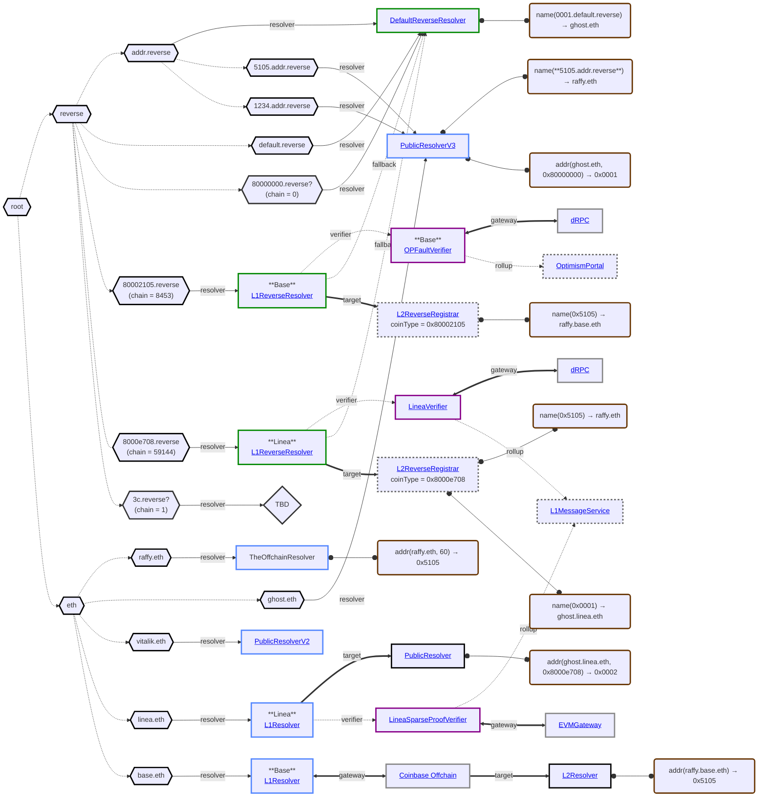
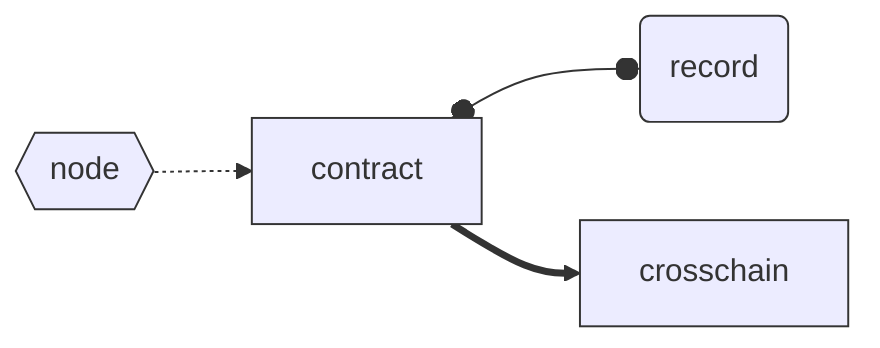

# L2 Primary Name Deployment

<!-- https://mermaid.js.org/syntax/flowchart.html -->

#### Graph Legend

## Resolution Examples

1. `reverse(0x5105, 60)`
   - `resolve("5105.addr.reverse", name())`
     - `resolver("5105.addr.reverse") = PublicResolverV3`
       - `name() = "raffy.eth"`
       - `resolve("raffy.eth", multicall(addr(), addr(0x80000000)))`
       - `resolver("raffy.eth") = TheOffchainResolver`
         - `resolve() = [0x5105, 0x]`
         - `checkedAddress = 0x5105 == 0x5105` &rarr; ✅️
1. `reverse(0x1234, 60)`
   - `resolve("1234.addr.reverse", name())`
     - `resolver("1234.addr.reverse") = PublicResolverV3`
       - `resolve(name()) = ""` &rarr; 🛑️
1. `reverse(0x0001, 60)`
   - `resolve("0001.addr.reverse", name()`
   - `resolver("0001.addr.reverse") = null`
   - `resolver("addr.reverse") = DefaultReverseResolver`
     - `resolve(name()) = "ghost.eth"`
     - `resolve("ghost.eth", multicall(addr(), addr(0x80000000)))`
     - `resolver("ghost.eth") = PublicResolverV3`
       - `resolve() = [0x, 0x0001]`
       - `checkedAddress = 0x0001 == 0x0001` &rarr; ✅️
1. `reverse(0x5105, 0x80000000)`
   - `resolve("5105.default.reverse", name())`
     - `resolver("5105.default.reverse") = null`
     - `resolver("default.reverse") = DefaultReverseResolver`
       - `resolve(name()) = ""` &rarr; 🛑️
1. `reverse(0x5105, 0x8000e708)`
   - `resolve("5105.8000e708.reverse", name())`
     - `resolver("5105.8000e708.reverse) = null`
     - `resolver("8000e708.reverse") = L1ReverseResolver`
       - `resolve(name()) = "raffy.eth"` (L1 &rarr; L2)
       - `resolve("raffy.eth", multicall(addr(0x8000e708), addr(0x80000000)))`
       - `resolver("raffy.eth") = TheOffchainResolver`
         - `resolve() = [0x, 0x]`
         - `checkedAddress = 0x` &rarr; 🛑️
1. `reverse(0x0001, 0x8000e708)`
   - `resolve("0001.8000e708.reverse", name())`
   - `resolver("0001.8000e708.reverse) = null`
   - `resolver("8000e708.reverse") = L1ReverseResolver`
     - `resolve(name()) = "ghost.linea.eth"` (L1 &rarr; L2)
     - `resolve("ghost.linea.eth", multicall(addr(0x8000e708), addr(0x80000000)))`
     - `resolver("ghost.linea.eth") = null`
     - `resolver("linea.eth") = LineaL1Resolver`
       - `resolve() = [0x0002, 0x]`
       - `checkedAddress = 0x0002 != 0x0001` &rarr; 🛑️
